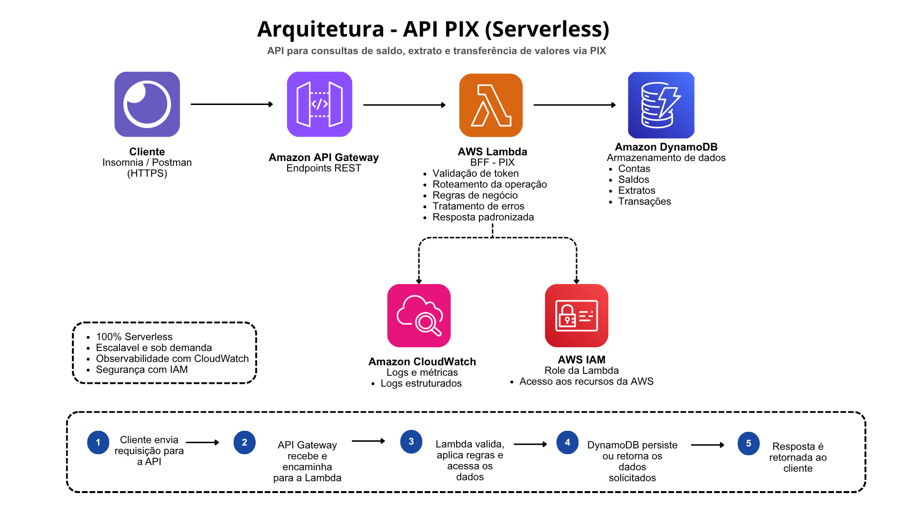

## 💸 API PIX — Serverless (AWS)

API serverless para consulta de saldo, extrato e transferência de valores via PIX.

### 🧠 **Objetivo**

Este projeto simula uma API de pagamentos (PIX), utilizando uma arquitetura serverless na AWS.

O foco é demonstrar:
- construção de uma camada BFF
- boas práticas de organização de código
- uso de serviços AWS
- observabilidade e tratamento de erros

### 🏗️ **Arquitetura**



### ⚙️ **Componentes**

- **API Gateway**
  - Exposição dos endpoints REST
  - Entrada da aplicação

- **AWS Lambda (BFF)**
  - Validação de token
  - Roteamento de requisições
  - Regras de negócio
  - Tratamento de erros
  - Resposta padronizada

- **DynamoDB**
  - Armazenamento de contas, saldos e transações

- **CloudWatch**
  - Logs estruturados
  - Métricas e monitoramento

- **IAM**
  - Role utilizada pela Lambda para acesso aos recursos AWS


### 🔄 **Fluxo da aplicação**

1. Cliente envia requisição HTTP
2. API Gateway recebe e encaminha para a Lambda
3. Lambda valida o token e identifica a operação
4. Lambda executa regras de negócio
5. DynamoDB persiste ou retorna os dados
6. Resposta é retornada ao cliente


## 🔌 Endpoints

### 📊 Consultar saldo

```http
GET /saldo?contaId={id}
```

### 📄 Consultar extrato
```http
GET /extrato?contaId={id}
```

### 💸 Transferência
```http
POST /transferencia
```

**Body:**
```json
{
  "contaOrigem": "conta1",
  "contaDestino": "conta2",
  "valor": 100
}
```

### 🔐 **Segurança**

- Validação de token na Lambda
- Verificação de autorização por conta
- Uso de IAM Role para acesso aos serviços AWS

>🔧 Melhoria futura: aplicar políticas mais restritas seguindo o princípio de least privilege

### 📊 **Observabilidade**

- Logs estruturados no CloudWatch
- Registro de erros e eventos importantes

### 🧪 **Testes**

- Testes unitários para os serviços
- Validação de cenários de sucesso e erro
 
### ⚖️ **Trade-offs**

**Lambda vs ECS/Fargate**
- Lambda: mais simples, serverless e com menor custo operacional
- ECS/Fargate: maior controle, porém maior complexidade

**DynamoDB vs RDS**
- DynamoDB: melhor para acesso por chave (contaId)
- RDS: melhor para consultas relacionais complexas

### 🚀 **Melhorias futuras**

- Criação de um front-end (ex: Angular) hospedado em S3
- Implementação de SQS para processamento assíncrono
- Uso de SNS para notificações
- Implementação de circuit breaker
- Aplicação de políticas IAM mais restritivas
- CI/CD com GitHub Actions
- Infraestrutura como código (Terraform/CloudFormation)

### 🛠️ **Tecnologias**

- Python
- AWS Lambda
- API Gateway
- DynamoDB
- CloudWatch
- IAM

### 🧩 **Arquitetura Hexagonal**

O projeto segue princípios de Arquitetura Hexagonal (Ports and Adapters) para organizar melhor o código e separar responsabilidades.

#### **Conceito**

A lógica de negócio é isolada de detalhes externos como AWS, banco de dados e frameworks.

Isso permite:
- maior testabilidade
- menor acoplamento
- facilidade de manutenção e evolução

#### **Aplicação no projeto**

Lambda (handler) → atua como adapter de entrada

Services → representam a lógica de negócio (core)

DynamoDB → adapter de saída (infraestrutura)

#### **Benefícios**

- Facilita testes unitários
- Permite trocar tecnologias sem impactar o core
- Melhora organização do código

### 📌 **Considerações**
Este projeto foi desenvolvido com foco em demonstrar conhecimentos em arquitetura serverless, APIs e integração com serviços AWS, seguindo boas práticas de organização e observabilidade. 🙂